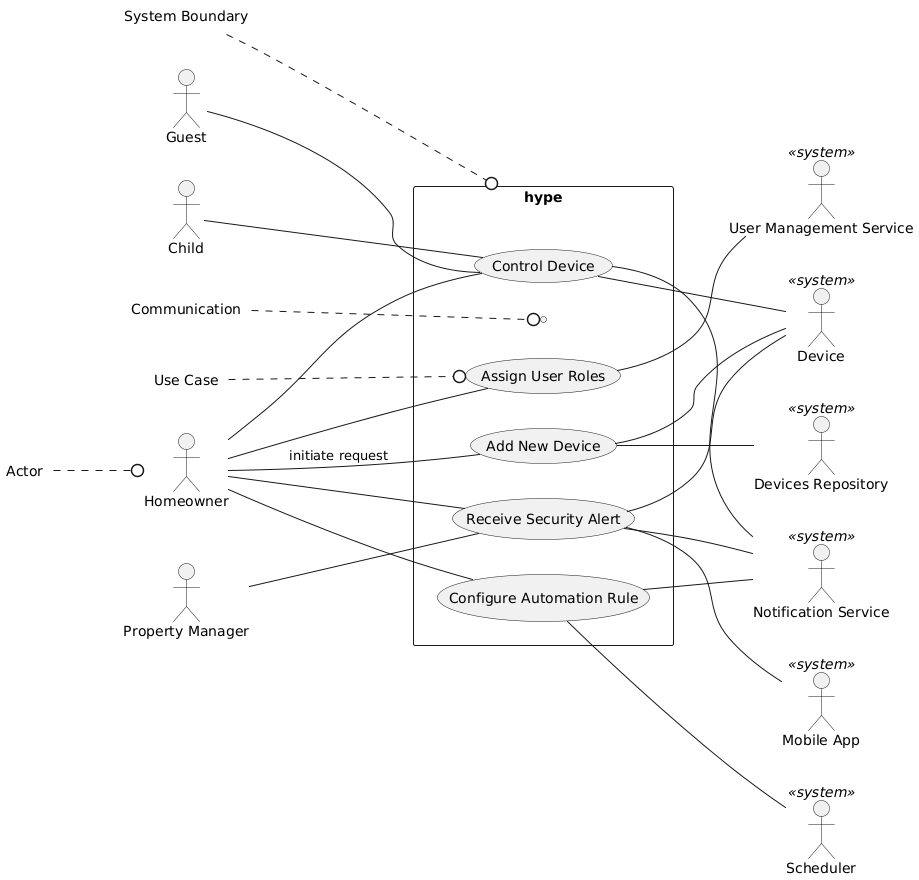

# Fully Dressed Use Cases

## Use Case Diagram

### Use Case 1 - Add a New IoT Device

**Use Case Name**  
Add a New IoT Device

**Scope**  
hype Home Automation System

**Level**  
User-goal

**Primary Actor**  
Homeowner (Administrator), Co-owner (Spouse)

**Stakeholders and Interests**  
- Homeowner/Co-owner - A homeowner wants to quickly and securely add new devices to their home for centralized control.  
- Device Manufacturer - A device manufacturer is interested in seamless device onboarding and accurate representation in the system.  
- System - The system wants to ensure that only authorized devices join the system, and that onboarding is secure and user-friendly.

**Preconditions**  
- User is authenticated with admin rights or relevant elevated permissions.
- New device is powered on and in pairing mode.

**Success Guarantee**  
- Device is securely registered
- Device is visible in the system
- Device is controllable from the user's dashboard (web and mobile)

**Main Success Scenario**  
1. Homeowner selects “Add Device” in the dashboard.
2. System offers options to,
   a. Scan for the device using WiFi, or other commonly supported device comms protocols.  
   c. Manually add devices using a in-app manufacturer/device list
3. Homeowner chooses to scan for the device
4. System authenticates and securely establishes connection with the device by successfully performing an internal handshake with the device.
5. Device is added to the homeowner’s account and home location profile
6. Device appears in dashboard, ready for configuration and control.

**Extensions**  
1. Device not found - System prompts for manual input or troubleshooting.  
2. Device handshake mismatch - System offers to try again
3. Device firmware outdated - System offers to update before proceeding.  

**Special Requirements**  
- Device discoverred in less than 2 seconds 
- Secure onboarding - end-to-end encryption, multi-factor authentication

**Technology and Data Variations List**  
- Device is discovered over Wi-Fi, Zigbee, or Z-Wave   
- Manual lookup or auto-discovery using the system's scan method

**Frequency of Occurrence**  
- Moderate - Whenever users buy new devices or replaces ones causing issues.

**Miscellaneous**  
- Open issue - Supporting legacy devices with limited protocol support

---

### Use Case 2: Control a Device

**Use Case Name**  
Control a Device

**Scope**  
hype Home Automation System

**Level**  
User-goal

**Primary Actor**  
Homeowner, Co-owner, Child and/or Guest added to home location profile

**Stakeholders and Interests**  
- Homeowner/Co-owner/Child/Guest - Wants instant and reliable control of home devices.  
- System - Wants to ensure only authorized commands are executed.

**Preconditions**  
- User is logged in and has permissions for device control.  
- Device is registered and online.

**Success Guarantee**  
- Device responds to command and state updates in dashboard.

**Main Success Scenario**  
1. User selects device from dashboard.
2. User issues a command (e.g., turn light ON).
3. System sends command to device via relevant protocol.
4. Device responds and confirms state change.
5. Dashboard updates to reflect new state.

**Extensions**  
1. Device is offline - System notifies user and offers to retry or schedule.  
2. Device does not respond - System retries N times, then reports error.  
3. Device state change is not recognized by the system.
4. Device can respond but not acknowledge system's command.

**Special Requirements**  
- Local commands response time from the device's end should be less than 200ms  
- Secure command transmission

**Technology and Data Variations List**  
- Control via mobile app, web UI, or voice assistant  
- Protocol - Zigbee, Z-Wave, Wi-Fi

**Frequency of Occurrence**  
- High - Multiple times per day, per user registered as part of the household location profile

**Miscellaneous**  
- Support for batch commands (e.g., “turn all lights off”).

---

### Use Case 3: Configure Automation Rule

**Use Case Name**  
Configure Automation Rule

**Scope**  
hype Home Automation Platform

**Level**  
User-goal

**Primary Actor**  
Homeowner, Co-owner

**Stakeholders and Interests**  
- Homeowner/Co-owner - Wants to automate routine and security-related device actions. 
- System - Wants reliable automation execution.

**Preconditions**  
- User is authenticated and authorized.  
- At least one device is registered.

**Success Guarantee**  
- Automation rule is active and triggers as specified.

**Main Success Scenario**  
1. Homeowner navigates to Automation Rules.
2. Homeowner creates a new rule (e.g., “If motion detected after 10pm, turn on hallway lights").
3. System presents available triggers/actions.
4. Homeowner selects triggers and actions, sets conditions.
5. System validates rule.
6. Homeowner saves rule.
7. Rule is now active and monitored by system.

**Extensions**  
1. Rule conflicts with another - System suggests resolution.
2. Action or trigger not supported-  System notifies user.

**Special Requirements**  
- Real-time trigger evaluation  
- Rule configuration user experience - preferably similar to IFTTT (If This, Then That) sort of rule builder layout.

**Technology and Data Variations List**  
- Rule creation via web, mobile, or import/export of JSON/YAML (for developers) 
- Scheduled, event-based, or conditional triggers

**Frequency of Occurrence**  
- Moderate - Whenever user wants to set up or adjust automations.

**Miscellaneous**  
- Support for rule templates.

---

### Use Case 4: Receive Security Alert

**Use Case Name**  
Receive Security Alert

**Scope**  
hype Home Automation Platform

**Level**  
User-goal

**Primary Actor**  
Homeowner, Co-owner, Property Manager

**Stakeholders and Interests**  
- Homeowner/Co-owner/Property Manager - Wants timely, actionable security alerts.  
- Hype Platform - Wants reliable, secure alert delivery.

**Preconditions**  
- User has enabled alerts and registered notification channels.  
- Security devices are online and configured.

**Success Guarantee**  
- User receives alert with event details in a timely and secure manner.

**Main Success Scenario**  
1. Security device detects anomaly (e.g., door forced open, glass break, smart fire alarm etc).
2. Device reports event to platform.
3. System evaluates event against user alert rules.
4. System generates and sends alert (push, SMS, email, etc.).
5. User receives alert and can view event details (e.g., camera snapshot).

**Extensions**  
1. User does not respond - System escalates to backup contact.  
2. Device malfunctions - System logs event and notifies admin.  
3. Notification delivery fails - System retries or uses alternate channel.

**Special Requirements**  
- end-to-end encrypted notifications  
- Alert delivery delay is less than 500ms for critical events

**Technology and Data Variations List**  
- Notification via mobile push, SMS, email, or in-app  
- Event details - text, image, video clip, noise profile (for glass break)

**Frequency of Occurrence**  
- Low to moderate - Depends on home security activity.

**Miscellaneous**  
- Customizable escalations for property managers.

---

### Use Case 5: Assign User Roles and Permissions

**Use Case Name**  
Assign User Roles and Permissions

**Scope**  
hype Home Automation Platform

**Level:**  
User-goal

**Primary Actor**  
Homeowner (Administrator)

**Stakeholders and Interests**  
- Homeowner/Admin - Wants granular control over user access and device control.  
- Guests/Children/Co-owner - Need access appropriate to their needs.  
- System - Wants to ensure secure and auditable access.

**Preconditions**  
- User is authenticated as admin.  
- Other users are registered or invited.

**Success Guarantee**  
- User roles and permissions are saved and immediately enforced.

**Main Success Scenario**  
1. Admin navigates to User Management.
2. Admin selects or invites a user.
3. Admin assigns role (admin, guest, child, co-owner) and custom permissions.
4. System validates permissions for conflicts and security.
5. Admin saves changes.
6. System updates access controls for the user.

**Extensions**  
4a. Permissions conflict with policy - System rejects and explains issue.  
2a. User email invalid - System rejects invite.

**Special Requirements**  
- Role-based access control (RBAC)  
- Datalog entries for permission changes

**Technology and Data Variations List**  
- Management via web or mobile  
- Import/export of users/roles

**Frequency of Occurrence**  
- Low to moderate - Onboarding, offboarding, or changing household composition.

**Miscellaneous:**  
- Open issue - Delegating temporary access for service providers such as cleaners, etc

---

## Sequence Diagram (Encloses all use cases)

### [Back to Home](https://sxr3455.github.io/hype/)
